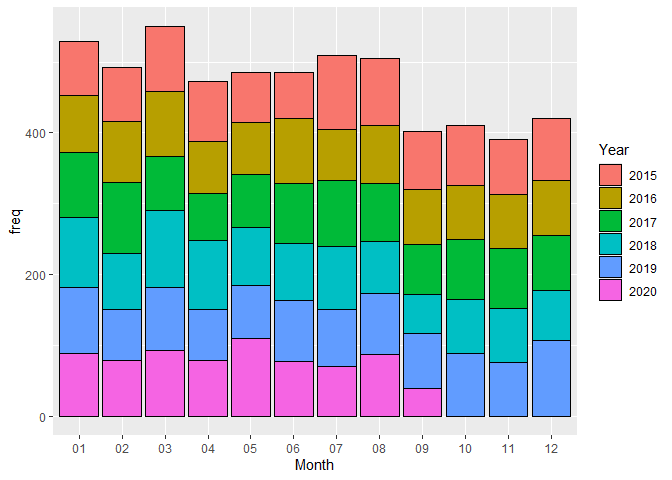
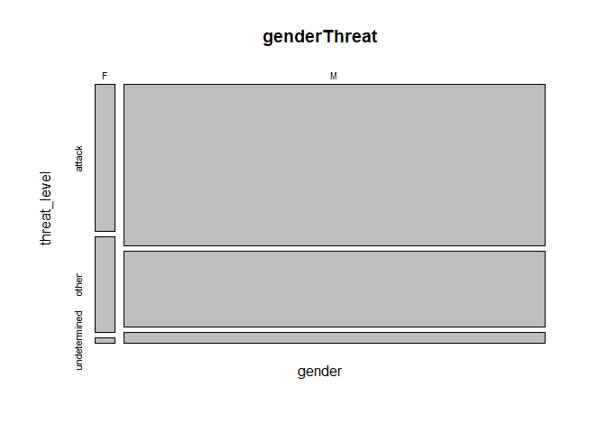
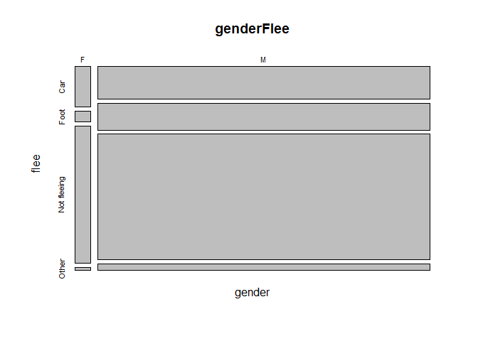
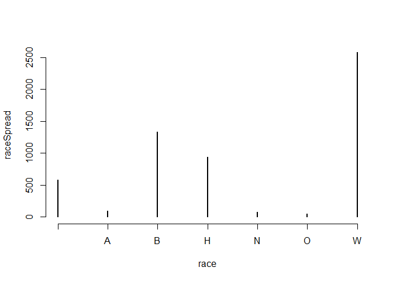
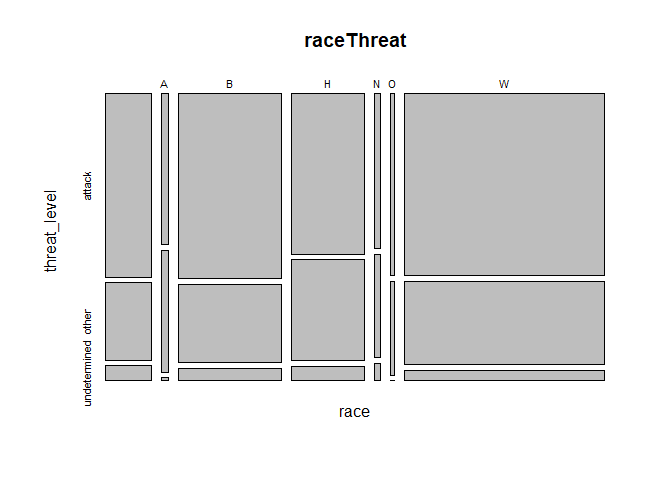
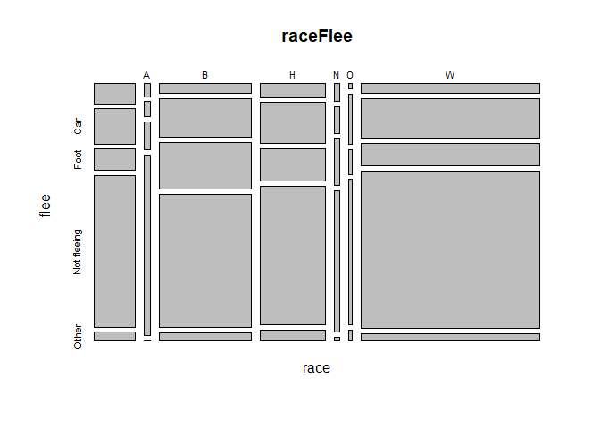
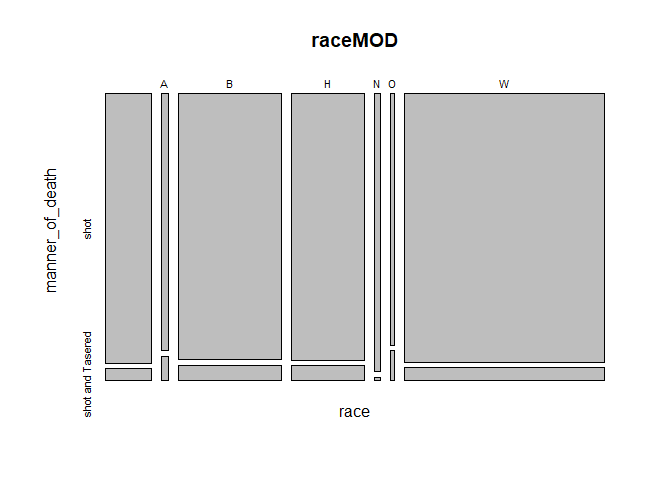
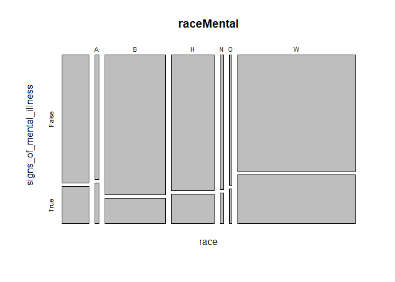

Police Shootings in the US
================

- [Libraries](#libraries)
- [The Data](#the-data)
- [The Study](#the-study)
- [Analysis](#analysis)
- [Gender](#gender)
- [Answer to Question 1](#answer-to-question-1)
- [Race](#race)
- [Answer to Question 2](#answer-to-question-2)
- [State](#state)
- [Answer to Question 3](#answer-to-question-3)
- [Summary of Results / Answers to
  Questions](#summary-of-results--answers-to-questions)

# Libraries

``` r
suppressMessages(library(foreign))
suppressMessages(library(tidyverse))
suppressMessages(library(ggplot2))
suppressMessages(library(tigerstats))
suppressMessages(library(ggplot2))
suppressMessages(library(plyr))
```

# The Data

The data I will be using are from [The Washington
Post](https://www.washingtonpost.com/graphics/investigations/police-shootings-database/)
article, the data:
[GitHub](https://github.com/washingtonpost/data-police-shootings)

**as identified in the article:**

**id:** a unique identifier for each victim

**name:** the name of the victim

**date:** the date of the fatal shooting in YYYY-MM-DD format

**manner_of_death:**

- shot

- shot and Tasered

**armed:** indicates that the victim was armed with some sort of
implement that a police officer believed could inflict harm

- **undetermined:** it is not known whether or not the victim had a
  weapon
- **unknown:** the victim was armed, but it is not known what the object
  was
- **unarmed:** the victim was not armed

**age:** the age of the victim

**gender:** the gender of the victim. The Post identifies victims by the
gender they identify with if reports indicate that it differs from their
biological sex.

- **M:** Male
- **F:** Female
- **None:** unknown

**race:**

- **W:** White, non-Hispanic
- **B:** Black, non-Hispanic
- **A:** Asian
- **N:** Native American
- **H:** Hispanic
- **O:** Other
- **None:** unknown

**city:** the municipality where the fatal shooting took place. Note
that in some cases this field may contain a county name if a more
specific municipality is unavailable or unknown.

**state:** two-letter postal code abbreviation

**signs of mental illness:** News reports have indicated the victim had
a history of mental health issues, expressed suicidal intentions or was
experiencing mental distress at the time of the shooting.

**flee:** News reports have indicated the victim was moving away from
officers

- Foot
- Car
- Not fleeing

The threat column and the fleeing column are not necessarily related.
For example, there is an incident in which the suspect is fleeing and at
the same time turns to fire at gun at the officer. Also, attacks
represent a status immediately before fatal shots by police while
fleeing could begin slightly earlier and involve a chase.

**body_camera:** News reports have indicated an officer was wearing a
body camera and it may have recorded some portion of the incident.

**latitude and longitude:** the location of the shooting expressed as
WGS84 coordinates, geocoded from addresses. The coordinates are rounded
to 3 decimal places, meaning they have a precision of about 80-100
meters within the contiguous U.S.”

# The Study

The main purpose of analyzing police shootings over the last 5 years in
the United States is to determine if there’s any patterns with
individuals involved in the shootings, whether it’s with race, location,
mental stability, etc. The goals of this research are to simply examine
the variables related to fatal police shootings and determine any sort
of correlations or patterns between them. For most of the data
analysis/exploration, since the majority of variables are characters and
not numeric, I’ll be using xtabs functions, giving the totals of each
variable given another variable. I’ll also be showing percentages when
it seems beneficial for clarity or further examination of the variables
in question.

(With the xtabs plots you’ll see for most of the variable testing, the
main sign of differences between the variable in question, whether
gender, race, etc. is the different size of the bars in regard to their
length on the Y axis.)

**The main questions I’ll be answering and expounding upon are as
follows:**

**1.** Are there major differences between Male and Female circumstances
in fatal police shootings?

**2.** Are different races more likely to be involved in fatal police
shootings with similar situations?

**3.** Are different states more likely to have fatal police shootings
and if so, why?

``` r
police <- read.csv("fatal-police-shootings-data.csv")
head(police)
```

    ##   id               name       date  manner_of_death      armed age gender race
    ## 1  3         Tim Elliot 2015-01-02             shot        gun  53      M    A
    ## 2  4   Lewis Lee Lembke 2015-01-02             shot        gun  47      M    W
    ## 3  5 John Paul Quintero 2015-01-03 shot and Tasered    unarmed  23      M    H
    ## 4  8    Matthew Hoffman 2015-01-04             shot toy weapon  32      M    W
    ## 5  9  Michael Rodriguez 2015-01-04             shot   nail gun  39      M    H
    ## 6 11  Kenneth Joe Brown 2015-01-04             shot        gun  18      M    W
    ##            city state signs_of_mental_illness threat_level        flee
    ## 1       Shelton    WA                    True       attack Not fleeing
    ## 2         Aloha    OR                   False       attack Not fleeing
    ## 3       Wichita    KS                   False        other Not fleeing
    ## 4 San Francisco    CA                    True       attack Not fleeing
    ## 5         Evans    CO                   False       attack Not fleeing
    ## 6       Guthrie    OK                   False       attack Not fleeing
    ##   body_camera longitude latitude is_geocoding_exact
    ## 1       False  -123.122   47.247               True
    ## 2       False  -122.892   45.487               True
    ## 3       False   -97.281   37.695               True
    ## 4       False  -122.422   37.763               True
    ## 5       False  -104.692   40.384               True
    ## 6       False   -97.423   35.877               True

``` r
colnames(police)
```

    ##  [1] "id"                      "name"                   
    ##  [3] "date"                    "manner_of_death"        
    ##  [5] "armed"                   "age"                    
    ##  [7] "gender"                  "race"                   
    ##  [9] "city"                    "state"                  
    ## [11] "signs_of_mental_illness" "threat_level"           
    ## [13] "flee"                    "body_camera"            
    ## [15] "longitude"               "latitude"               
    ## [17] "is_geocoding_exact"

# Analysis

**Average age and standard deviation of the individuals involved in the
involved police shootings**

I was expecting the mean age to be a little bit lower but with such a
high standard deviation it makes sense that most people involved in
police shootings aren’t at the extremes of the age spectrum (very
old/very young).

``` r
mean(police$age, na.rm=TRUE)
```

    ## [1] 37.14812

``` r
sd(police$age, na.rm=TRUE)
```

    ## [1] 13.08881

# Gender

\##Are there major differences between Male and Female circumstances in
fatal police shootings?##

**The spread of male/female individuals involved in police shootings**

``` r
genderSpread <- xtabs(~gender, data=police)
genderSpread
```

    ## gender
    ##         F    M 
    ##    1  249 5402

``` r
rowPerc(genderSpread)
```

    ##       
    ## gender         F     M Total
    ##        0.02 4.41 95.58   100

**Fatal police shootings each month of each year**

There doesn’t seem to be any trends when it comes to how many police
shootings occur in each month or if a specific year had more than
another.

``` r
#separate the date variable and replace columns
police <- separate(police, "date", c("Year", "Month", "Day"), sep = "-")

#plot of number of fatal shootings by month
monthyear = count(police, vars = c("Month","Year"))
ggplot(data = monthyear) + geom_bar(aes(x = Month, y = freq, fill = Year), color="black", stat="identity")
```

<!-- -->

**Gender & Race**

The spread seems fairly similar between the genders and races

- excluding entry 2659 (no gender given) for ease of display

``` r
genderRace <- xtabs(~gender+race, exclude = "", data=police)
genderRace
```

    ##       race
    ## gender    A    B    H    N    O    W
    ##      F    4   48   29    5    3  148
    ##      M   89 1289  907   75   44 2427

``` r
#percent of gender in each race
rowPerc(genderRace)
```

    ##       race
    ## gender      A      B      H      N      O      W  Total
    ##      F   1.69  20.25  12.24   2.11   1.27  62.45 100.00
    ##      M   1.84  26.68  18.77   1.55   0.91  50.24 100.00

**Gender & Manner of Death**

``` r
genderMOD <- xtabs(~gender+manner_of_death, exclude = "", data=police)
genderMOD
```

    ##       manner_of_death
    ## gender shot shot and Tasered
    ##      F  242                7
    ##      M 5128              274

``` r
#percent of each manner of death by gender
rowPerc(genderMOD)
```

    ##       manner_of_death
    ## gender   shot shot and Tasered  Total
    ##      F  97.19             2.81 100.00
    ##      M  94.93             5.07 100.00

``` r
plot(genderMOD)
```

<!-- -->

**Gender & Threat Level**

It seems to be that both Male and Female have a similar spread of their
threat levels.

``` r
genderThreat <- xtabs(~gender+threat_level, exclude = "", data=police)
genderThreat
```

    ##       threat_level
    ## gender attack other undetermined
    ##      F    147    96            6
    ##      M   3511  1650          241

``` r
#percent of each threat level response by gender
rowPerc(genderThreat)
```

    ##       threat_level
    ## gender attack  other undetermined  Total
    ##      F  59.04  38.55         2.41 100.00
    ##      M  64.99  30.54         4.46 100.00

``` r
plot(genderThreat)
```

<!-- -->

**Gender & Signs of Mental Illness**

It’s interesting to see that the Females involved in police shootings
are more likely to have signs of mental illnesses when compared with
men.

``` r
genderMental <- xtabs(~gender+signs_of_mental_illness, exclude = "", data=police)
genderMental
```

    ##       signs_of_mental_illness
    ## gender False True
    ##      F   167   82
    ##      M  4168 1234

``` r
#percent of mental illness response by gender
rowPerc(genderMental)
```

    ##       signs_of_mental_illness
    ## gender  False   True  Total
    ##      F  67.07  32.93 100.00
    ##      M  77.16  22.84 100.00

``` r
plot(genderMental)
```

<!-- -->

**Gender & Fleeing**

It looks as though Male and Female individuals have similar flee
responses.

``` r
#gender + flee
genderFlee <- xtabs(~gender+flee, exclude = "", data=police)
plot(genderFlee)
```

<!-- -->

**Gender spread of Fleeing & Race**

``` r
#gender + flee + race
genderFleeRace <- xtabs(~gender+flee+race, exclude = "", data=police)
ftable(genderFleeRace)
```

    ##                    race    A    B    H    N    O    W
    ## gender flee                                          
    ## F      Car                 0   11    3    0    1   34
    ##        Foot                0    1    3    1    0    6
    ##        Not fleeing         4   34   20    4    2  102
    ##        Other               0    0    1    0    0    3
    ## M      Car                 6  211  159    9    9  398
    ##        Foot               11  263  127   15    5  241
    ##        Not fleeing        67  722  530   44   27 1611
    ##        Other               0   42   39    1    2   73

# Answer to Question 1

**Are there major differences between Male and Female circumstances in
fatal police shootings?**

When analyzing the relations between these 5 different variables with
regards to gender, there doesn’t seem to be any extreme differences when
it comes to the spread of variables separated by gender. What I did find
interesting, was the 10% difference with signs of mental illnesses.
According to the data descriptions, “News reports have indicated the
victim had a history of mental health issues, expressed suicidal
intentions or was experiencing mental distress at the time of the
shooting.” I’m not sure whether this could be due to the fact that since
males are more involved in these fatal police shootings, that when
females are involved, since it is less likely, the reason they are is
because of this higher chance of having signs of mental illness. Since
the spread of the other variables when separated by gender don’t seem to
have much of a significant difference.

# Race

**Are different races more likely to be involved in fatal police
shootings with similar situations?**

**The spread of race of the individuals involved in police shootings**

``` r
#spread of races involved in the shootings
raceSpread <- xtabs(~race, data=police)
raceSpread
```

    ## race
    ##         A    B    H    N    O    W 
    ##  583   93 1337  936   80   47 2576

``` r
rowPerc(raceSpread)
```

    ##     
    ## race          A     B     H    N    O     W Total
    ##      10.31 1.65 23.66 16.56 1.42 0.83 45.58   100

``` r
plot(raceSpread)
```

<!-- -->

**Race & Threat Level**

There doesn’t seem to be much of a difference in the spread of the
different threat levels between each race.

``` r
raceThreat <- xtabs(~race+threat_level, data=police)
raceThreat
```

    ##     threat_level
    ## race attack other undetermined
    ##         388   163           32
    ##    A     51    41            1
    ##    B    897   379           61
    ##    H    544   342           50
    ##    N     45    30            5
    ##    O     31    16            0
    ##    W   1702   776           98

``` r
#percent of each threat level response by race
rowPerc(raceThreat)
```

    ##     threat_level
    ## race attack  other undetermined  Total
    ##       66.55  27.96         5.49 100.00
    ##    A  54.84  44.09         1.08 100.00
    ##    B  67.09  28.35         4.56 100.00
    ##    H  58.12  36.54         5.34 100.00
    ##    N  56.25  37.50         6.25 100.00
    ##    O  65.96  34.04         0.00 100.00
    ##    W  66.07  30.12         3.80 100.00

``` r
#visual of the spread of the data
plot(raceThreat)
```

<!-- -->

**Race & Armed**

There doesn’t seem to be one race with a significant difference in
percents with how they were armed.

``` r
#race on x axis for ease of display
raceArmed <- xtabs(~armed+race, data=police)
raceArmed
```

    ##                                   race
    ## armed                                      A    B    H    N    O    W
    ##                                       9    3   59   42    2    3   94
    ##   air conditioner                     0    0    0    0    0    0    1
    ##   air pistol                          0    0    0    0    0    0    1
    ##   Airsoft pistol                      2    0    0    0    1    0    0
    ##   ax                                  3    2    1    2    0    0   16
    ##   barstool                            0    0    0    1    0    0    0
    ##   baseball bat                        2    1    5    4    0    0    7
    ##   baseball bat and bottle             0    0    0    0    0    0    1
    ##   baseball bat and fireplace poker    0    0    0    0    0    0    1
    ##   baseball bat and knife              0    0    0    0    0    0    1
    ##   baton                               2    0    3    0    0    0    1
    ##   bayonet                             0    0    0    1    0    0    0
    ##   BB gun                              0    0    2    0    0    0    3
    ##   BB gun and vehicle                  0    0    0    0    0    0    1
    ##   bean-bag gun                        0    0    0    1    0    0    0
    ##   beer bottle                         2    0    0    0    0    0    1
    ##   blunt object                        0    0    0    1    1    0    3
    ##   bottle                              0    0    1    0    0    0    0
    ##   bow and arrow                       0    0    0    0    0    1    0
    ##   box cutter                          1    0    3    2    0    0    6
    ##   brick                               0    0    0    1    0    0    1
    ##   car, knife and mace                 0    0    0    0    0    0    1
    ##   carjack                             0    0    0    0    0    0    1
    ##   chain                               0    0    2    0    0    0    1
    ##   chain saw                           1    0    0    0    0    0    1
    ##   chainsaw                            0    0    0    0    0    0    1
    ##   chair                               0    0    2    1    0    0    1
    ##   claimed to be armed                 0    0    0    0    0    0    1
    ##   contractor's level                  0    0    0    1    0    0    0
    ##   cordless drill                      0    0    0    0    0    0    1
    ##   crossbow                            3    0    0    0    0    0    6
    ##   crowbar                             0    0    1    2    0    0    1
    ##   fireworks                           0    0    0    0    0    0    1
    ##   flagpole                            0    0    1    0    0    0    0
    ##   flashlight                          1    0    0    0    0    0    1
    ##   garden tool                         0    0    0    1    0    0    1
    ##   glass shard                         1    0    0    1    0    0    1
    ##   grenade                             0    0    0    0    0    0    1
    ##   gun                               344   36  786  469   41   19 1517
    ##   gun and car                         2    0    3    2    0    0    4
    ##   gun and knife                       3    2    3    6    0    0    4
    ##   gun and machete                     0    0    0    0    0    0    1
    ##   gun and sword                       0    0    0    0    0    0    1
    ##   gun and vehicle                     0    0    2    4    0    0    5
    ##   guns and explosives                 0    0    2    0    0    0    1
    ##   hammer                              2    2    1    4    0    0    7
    ##   hand torch                          0    0    0    1    0    0    0
    ##   hatchet                             0    0    1    0    0    0   10
    ##   hatchet and gun                     0    1    0    0    0    0    1
    ##   ice pick                            0    0    0    0    0    0    1
    ##   incendiary device                   0    1    0    1    0    0    0
    ##   knife                             100   27  155  161   17   13  366
    ##   lawn mower blade                    0    0    1    0    0    0    1
    ##   machete                             6    1   12   15    0    0   13
    ##   machete and gun                     0    0    0    0    0    0    1
    ##   meat cleaver                        0    0    3    2    0    0    0
    ##   metal hand tool                     0    0    1    0    0    0    0
    ##   metal object                        2    0    0    1    0    0    1
    ##   metal pipe                          2    0    2    4    0    0    6
    ##   metal pole                          0    0    0    1    0    0    2
    ##   metal rake                          0    0    0    0    0    0    1
    ##   metal stick                         0    0    0    1    0    0    2
    ##   motorcycle                          0    0    1    0    0    0    0
    ##   nail gun                            0    0    0    1    0    0    0
    ##   oar                                 0    0    0    0    0    0    1
    ##   pellet gun                          1    0    2    0    0    0    0
    ##   pen                                 0    1    0    0    0    0    0
    ##   pepper spray                        0    0    1    0    0    0    1
    ##   pick-axe                            0    0    0    4    0    0    0
    ##   piece of wood                       0    0    1    3    0    0    1
    ##   pipe                                0    0    0    4    0    0    2
    ##   pitchfork                           0    0    0    0    0    0    2
    ##   pole                                0    0    2    0    0    0    0
    ##   pole and knife                      0    0    0    1    0    0    1
    ##   rock                                0    0    3    0    0    0    3
    ##   samurai sword                       0    0    0    0    0    0    3
    ##   scissors                            0    1    0    2    2    0    2
    ##   screwdriver                         1    0    4    2    1    1    4
    ##   sharp object                        2    0    2    4    0    0    4
    ##   shovel                              2    0    0    3    0    0    2
    ##   spear                               0    0    0    1    0    0    0
    ##   stapler                             0    0    0    1    0    0    0
    ##   straight edge razor                 0    0    1    1    0    0    2
    ##   sword                               0    1    5    6    0    0   11
    ##   Taser                               2    0    9    5    1    0   10
    ##   tire iron                           1    0    0    0    0    0    1
    ##   toy weapon                         19    2   37   33    1    0  101
    ##   unarmed                             5    7  125   63    5    5  147
    ##   undetermined                       27    1   29   33    4    1   72
    ##   unknown weapon                     13    4   13   14    1    1   33
    ##   vehicle                            22    0   48   21    2    2   67
    ##   vehicle and gun                     0    0    1    0    0    1    2
    ##   vehicle and machete                 0    0    1    0    0    0    0
    ##   walking stick                       0    0    0    0    1    0    0
    ##   wasp spray                          0    0    0    0    0    0    1
    ##   wrench                              0    0    0    1    0    0    0

``` r
#percent of each armed response by race
colPerc(raceArmed)
```

    ##                                   race
    ## armed                                          A      B      H      N      O
    ##                                      1.54   3.23   4.41   4.49   2.50   6.38
    ##   air conditioner                    0.00   0.00   0.00   0.00   0.00   0.00
    ##   air pistol                         0.00   0.00   0.00   0.00   0.00   0.00
    ##   Airsoft pistol                     0.34   0.00   0.00   0.00   1.25   0.00
    ##   ax                                 0.51   2.15   0.07   0.21   0.00   0.00
    ##   barstool                           0.00   0.00   0.00   0.11   0.00   0.00
    ##   baseball bat                       0.34   1.08   0.37   0.43   0.00   0.00
    ##   baseball bat and bottle            0.00   0.00   0.00   0.00   0.00   0.00
    ##   baseball bat and fireplace poker   0.00   0.00   0.00   0.00   0.00   0.00
    ##   baseball bat and knife             0.00   0.00   0.00   0.00   0.00   0.00
    ##   baton                              0.34   0.00   0.22   0.00   0.00   0.00
    ##   bayonet                            0.00   0.00   0.00   0.11   0.00   0.00
    ##   BB gun                             0.00   0.00   0.15   0.00   0.00   0.00
    ##   BB gun and vehicle                 0.00   0.00   0.00   0.00   0.00   0.00
    ##   bean-bag gun                       0.00   0.00   0.00   0.11   0.00   0.00
    ##   beer bottle                        0.34   0.00   0.00   0.00   0.00   0.00
    ##   blunt object                       0.00   0.00   0.00   0.11   1.25   0.00
    ##   bottle                             0.00   0.00   0.07   0.00   0.00   0.00
    ##   bow and arrow                      0.00   0.00   0.00   0.00   0.00   2.13
    ##   box cutter                         0.17   0.00   0.22   0.21   0.00   0.00
    ##   brick                              0.00   0.00   0.00   0.11   0.00   0.00
    ##   car, knife and mace                0.00   0.00   0.00   0.00   0.00   0.00
    ##   carjack                            0.00   0.00   0.00   0.00   0.00   0.00
    ##   chain                              0.00   0.00   0.15   0.00   0.00   0.00
    ##   chain saw                          0.17   0.00   0.00   0.00   0.00   0.00
    ##   chainsaw                           0.00   0.00   0.00   0.00   0.00   0.00
    ##   chair                              0.00   0.00   0.15   0.11   0.00   0.00
    ##   claimed to be armed                0.00   0.00   0.00   0.00   0.00   0.00
    ##   contractor's level                 0.00   0.00   0.00   0.11   0.00   0.00
    ##   cordless drill                     0.00   0.00   0.00   0.00   0.00   0.00
    ##   crossbow                           0.51   0.00   0.00   0.00   0.00   0.00
    ##   crowbar                            0.00   0.00   0.07   0.21   0.00   0.00
    ##   fireworks                          0.00   0.00   0.00   0.00   0.00   0.00
    ##   flagpole                           0.00   0.00   0.07   0.00   0.00   0.00
    ##   flashlight                         0.17   0.00   0.00   0.00   0.00   0.00
    ##   garden tool                        0.00   0.00   0.00   0.11   0.00   0.00
    ##   glass shard                        0.17   0.00   0.00   0.11   0.00   0.00
    ##   grenade                            0.00   0.00   0.00   0.00   0.00   0.00
    ##   gun                               59.01  38.71  58.79  50.11  51.25  40.43
    ##   gun and car                        0.34   0.00   0.22   0.21   0.00   0.00
    ##   gun and knife                      0.51   2.15   0.22   0.64   0.00   0.00
    ##   gun and machete                    0.00   0.00   0.00   0.00   0.00   0.00
    ##   gun and sword                      0.00   0.00   0.00   0.00   0.00   0.00
    ##   gun and vehicle                    0.00   0.00   0.15   0.43   0.00   0.00
    ##   guns and explosives                0.00   0.00   0.15   0.00   0.00   0.00
    ##   hammer                             0.34   2.15   0.07   0.43   0.00   0.00
    ##   hand torch                         0.00   0.00   0.00   0.11   0.00   0.00
    ##   hatchet                            0.00   0.00   0.07   0.00   0.00   0.00
    ##   hatchet and gun                    0.00   1.08   0.00   0.00   0.00   0.00
    ##   ice pick                           0.00   0.00   0.00   0.00   0.00   0.00
    ##   incendiary device                  0.00   1.08   0.00   0.11   0.00   0.00
    ##   knife                             17.15  29.03  11.59  17.20  21.25  27.66
    ##   lawn mower blade                   0.00   0.00   0.07   0.00   0.00   0.00
    ##   machete                            1.03   1.08   0.90   1.60   0.00   0.00
    ##   machete and gun                    0.00   0.00   0.00   0.00   0.00   0.00
    ##   meat cleaver                       0.00   0.00   0.22   0.21   0.00   0.00
    ##   metal hand tool                    0.00   0.00   0.07   0.00   0.00   0.00
    ##   metal object                       0.34   0.00   0.00   0.11   0.00   0.00
    ##   metal pipe                         0.34   0.00   0.15   0.43   0.00   0.00
    ##   metal pole                         0.00   0.00   0.00   0.11   0.00   0.00
    ##   metal rake                         0.00   0.00   0.00   0.00   0.00   0.00
    ##   metal stick                        0.00   0.00   0.00   0.11   0.00   0.00
    ##   motorcycle                         0.00   0.00   0.07   0.00   0.00   0.00
    ##   nail gun                           0.00   0.00   0.00   0.11   0.00   0.00
    ##   oar                                0.00   0.00   0.00   0.00   0.00   0.00
    ##   pellet gun                         0.17   0.00   0.15   0.00   0.00   0.00
    ##   pen                                0.00   1.08   0.00   0.00   0.00   0.00
    ##   pepper spray                       0.00   0.00   0.07   0.00   0.00   0.00
    ##   pick-axe                           0.00   0.00   0.00   0.43   0.00   0.00
    ##   piece of wood                      0.00   0.00   0.07   0.32   0.00   0.00
    ##   pipe                               0.00   0.00   0.00   0.43   0.00   0.00
    ##   pitchfork                          0.00   0.00   0.00   0.00   0.00   0.00
    ##   pole                               0.00   0.00   0.15   0.00   0.00   0.00
    ##   pole and knife                     0.00   0.00   0.00   0.11   0.00   0.00
    ##   rock                               0.00   0.00   0.22   0.00   0.00   0.00
    ##   samurai sword                      0.00   0.00   0.00   0.00   0.00   0.00
    ##   scissors                           0.00   1.08   0.00   0.21   2.50   0.00
    ##   screwdriver                        0.17   0.00   0.30   0.21   1.25   2.13
    ##   sharp object                       0.34   0.00   0.15   0.43   0.00   0.00
    ##   shovel                             0.34   0.00   0.00   0.32   0.00   0.00
    ##   spear                              0.00   0.00   0.00   0.11   0.00   0.00
    ##   stapler                            0.00   0.00   0.00   0.11   0.00   0.00
    ##   straight edge razor                0.00   0.00   0.07   0.11   0.00   0.00
    ##   sword                              0.00   1.08   0.37   0.64   0.00   0.00
    ##   Taser                              0.34   0.00   0.67   0.53   1.25   0.00
    ##   tire iron                          0.17   0.00   0.00   0.00   0.00   0.00
    ##   toy weapon                         3.26   2.15   2.77   3.53   1.25   0.00
    ##   unarmed                            0.86   7.53   9.35   6.73   6.25  10.64
    ##   undetermined                       4.63   1.08   2.17   3.53   5.00   2.13
    ##   unknown weapon                     2.23   4.30   0.97   1.50   1.25   2.13
    ##   vehicle                            3.77   0.00   3.59   2.24   2.50   4.26
    ##   vehicle and gun                    0.00   0.00   0.07   0.00   0.00   2.13
    ##   vehicle and machete                0.00   0.00   0.07   0.00   0.00   0.00
    ##   walking stick                      0.00   0.00   0.00   0.00   1.25   0.00
    ##   wasp spray                         0.00   0.00   0.00   0.00   0.00   0.00
    ##   wrench                             0.00   0.00   0.00   0.11   0.00   0.00
    ##   Total                            100.00 100.00 100.00 100.00 100.00 100.00
    ##                                   race
    ## armed                                   W
    ##                                      3.65
    ##   air conditioner                    0.04
    ##   air pistol                         0.04
    ##   Airsoft pistol                     0.00
    ##   ax                                 0.62
    ##   barstool                           0.00
    ##   baseball bat                       0.27
    ##   baseball bat and bottle            0.04
    ##   baseball bat and fireplace poker   0.04
    ##   baseball bat and knife             0.04
    ##   baton                              0.04
    ##   bayonet                            0.00
    ##   BB gun                             0.12
    ##   BB gun and vehicle                 0.04
    ##   bean-bag gun                       0.00
    ##   beer bottle                        0.04
    ##   blunt object                       0.12
    ##   bottle                             0.00
    ##   bow and arrow                      0.00
    ##   box cutter                         0.23
    ##   brick                              0.04
    ##   car, knife and mace                0.04
    ##   carjack                            0.04
    ##   chain                              0.04
    ##   chain saw                          0.04
    ##   chainsaw                           0.04
    ##   chair                              0.04
    ##   claimed to be armed                0.04
    ##   contractor's level                 0.00
    ##   cordless drill                     0.04
    ##   crossbow                           0.23
    ##   crowbar                            0.04
    ##   fireworks                          0.04
    ##   flagpole                           0.00
    ##   flashlight                         0.04
    ##   garden tool                        0.04
    ##   glass shard                        0.04
    ##   grenade                            0.04
    ##   gun                               58.89
    ##   gun and car                        0.16
    ##   gun and knife                      0.16
    ##   gun and machete                    0.04
    ##   gun and sword                      0.04
    ##   gun and vehicle                    0.19
    ##   guns and explosives                0.04
    ##   hammer                             0.27
    ##   hand torch                         0.00
    ##   hatchet                            0.39
    ##   hatchet and gun                    0.04
    ##   ice pick                           0.04
    ##   incendiary device                  0.00
    ##   knife                             14.21
    ##   lawn mower blade                   0.04
    ##   machete                            0.50
    ##   machete and gun                    0.04
    ##   meat cleaver                       0.00
    ##   metal hand tool                    0.00
    ##   metal object                       0.04
    ##   metal pipe                         0.23
    ##   metal pole                         0.08
    ##   metal rake                         0.04
    ##   metal stick                        0.08
    ##   motorcycle                         0.00
    ##   nail gun                           0.00
    ##   oar                                0.04
    ##   pellet gun                         0.00
    ##   pen                                0.00
    ##   pepper spray                       0.04
    ##   pick-axe                           0.00
    ##   piece of wood                      0.04
    ##   pipe                               0.08
    ##   pitchfork                          0.08
    ##   pole                               0.00
    ##   pole and knife                     0.04
    ##   rock                               0.12
    ##   samurai sword                      0.12
    ##   scissors                           0.08
    ##   screwdriver                        0.16
    ##   sharp object                       0.16
    ##   shovel                             0.08
    ##   spear                              0.00
    ##   stapler                            0.00
    ##   straight edge razor                0.08
    ##   sword                              0.43
    ##   Taser                              0.39
    ##   tire iron                          0.04
    ##   toy weapon                         3.92
    ##   unarmed                            5.71
    ##   undetermined                       2.80
    ##   unknown weapon                     1.28
    ##   vehicle                            2.60
    ##   vehicle and gun                    0.08
    ##   vehicle and machete                0.00
    ##   walking stick                      0.00
    ##   wasp spray                         0.04
    ##   wrench                             0.00
    ##   Total                            100.00

**Race & Fleeing**

It seems that different races might use different methods of fleeing
when they do flee but the differences in percents don’t seem to be of a
very big amount for the size of the data.

``` r
raceFlee <- xtabs(~race+flee, data=police)
raceFlee
```

    ##     flee
    ## race       Car Foot Not fleeing Other
    ##        49   87   52         375    20
    ##    A    5    6   11          71     0
    ##    B   53  222  264         756    42
    ##    H   54  162  130         550    40
    ##    N    6    9   16          48     1
    ##    O    1   10    5          29     2
    ##    W  107  432  247        1714    76

``` r
#percent of each flee response by race
rowPerc(raceFlee)
```

    ##     flee
    ## race           Car   Foot Not fleeing  Other  Total
    ##        8.40  14.92   8.92       64.32   3.43 100.00
    ##    A   5.38   6.45  11.83       76.34   0.00 100.00
    ##    B   3.96  16.60  19.75       56.54   3.14 100.00
    ##    H   5.77  17.31  13.89       58.76   4.27 100.00
    ##    N   7.50  11.25  20.00       60.00   1.25 100.00
    ##    O   2.13  21.28  10.64       61.70   4.26 100.00
    ##    W   4.15  16.77   9.59       66.54   2.95 100.00

``` r
#visual of the data
plot(raceFlee)
```

<!-- -->

**Race & Manner of Death**

It also doesn’t look like any race is tasered before being fatally shot.

``` r
raceMOD <- xtabs(~race+manner_of_death, data=police)
raceMOD
```

    ##     manner_of_death
    ## race shot shot and Tasered
    ##       558               25
    ##    A   85                8
    ##    B 1264               73
    ##    H  886               50
    ##    N   79                1
    ##    O   42                5
    ##    W 2457              119

``` r
#percent of each manner of death response by race
rowPerc(raceMOD)
```

    ##     manner_of_death
    ## race   shot shot and Tasered  Total
    ##       95.71             4.29 100.00
    ##    A  91.40             8.60 100.00
    ##    B  94.54             5.46 100.00
    ##    H  94.66             5.34 100.00
    ##    N  98.75             1.25 100.00
    ##    O  89.36            10.64 100.00
    ##    W  95.38             4.62 100.00

``` r
#visual of the spread of the data
plot(raceMOD)
```

<!-- -->

**Race & Signs of Mental Illness**

There does seem to be a higher likelihood that if the individual is
white, they show signs of a mental illness.

``` r
raceMental <- xtabs(~race+signs_of_mental_illness, data=police)
raceMental
```

    ##     signs_of_mental_illness
    ## race False True
    ##        452  131
    ##    A    70   23
    ##    B  1129  208
    ##    H   767  169
    ##    N    65   15
    ##    O    37   10
    ##    W  1815  761

``` r
#percent of each mental illness response by race
rowPerc(raceMental)
```

    ##     signs_of_mental_illness
    ## race  False   True  Total
    ##       77.53  22.47 100.00
    ##    A  75.27  24.73 100.00
    ##    B  84.44  15.56 100.00
    ##    H  81.94  18.06 100.00
    ##    N  81.25  18.75 100.00
    ##    O  78.72  21.28 100.00
    ##    W  70.46  29.54 100.00

``` r
#visual of the spread of the data
plot(raceMental)
```

<!-- -->

# Answer to Question 2

**Are different races more likely to be involved in fatal police
shootings with similar situations?**

When analyzing the relations between these 5 different variables with
regards to race, there doesn’t seem to be any extreme differences when
it comes to the spread of variables separated by race. The only
significant differences seem to appear with the signs of mental
illnesses in each race. White individuals fatally shot by police have a
higher likelihood of displaying signs of mental illness. When looking at
how an individual was armed by race, there wasn’t one race that had a
significantly higher chance of being armed with an actual weapon or
perceived weapon more than other races. When there were differences in
the spread, like with knives and guns, both Asians and Other were much
more likely to be armed with a knife, ~20% less likely to be armed with
a gun than other races and ~10 percent more likely to be armed with a
knife.

# State

**Are different states more likely to have fatal police shootings and if
so, why?**

**The spread of responses by state of individuals involved in police
shootings**

``` r
#spread of races involved in the shootings
stateSpread <- xtabs(~state, data=police)
stateSpread
```

    ## state
    ##  AK  AL  AR  AZ  CA  CO  CT  DC  DE  FL  GA  HI  IA  ID  IL  IN  KS  KY  LA  MA 
    ##  40 104  84 261 837 208  21  14  13 373 194  30  35  43 108 100  50 101 114  35 
    ##  MD  ME  MI  MN  MO  MS  MT  NC  ND  NE  NH  NJ  NM  NV  NY  OH  OK  OR  PA  RI 
    ##  80  22  85  62 146  67  33 167  12  25  13  71 110 104 103 159 170  87 112   4 
    ##  SC  SD  TN  TX  UT  VA  VT  WA  WI  WV  WY 
    ##  92  17 148 502  68  97   9 159  95  54  14

``` r
#percent of fatal shootings by state
rowPerc(stateSpread)
```

    ##      
    ## state   AK   AL   AR   AZ    CA   CO   CT   DC   DE  FL   GA   HI   IA   ID
    ##       0.71 1.84 1.49 4.62 14.81 3.68 0.37 0.25 0.23 6.6 3.43 0.53 0.62 0.76
    ##      
    ## state   IL   IN   KS   KY   LA   MA   MD   ME  MI  MN   MO   MS   MT   NC   ND
    ##       1.91 1.77 0.88 1.79 2.02 0.62 1.42 0.39 1.5 1.1 2.58 1.19 0.58 2.95 0.21
    ##      
    ## state   NE   NH   NJ   NM   NV   NY   OH   OK   OR   PA   RI   SC  SD   TN   TX
    ##       0.44 0.23 1.26 1.95 1.84 1.82 2.81 3.01 1.54 1.98 0.07 1.63 0.3 2.62 8.88
    ##      
    ## state  UT   VA   VT   WA   WI   WV   WY Total
    ##       1.2 1.72 0.16 2.81 1.68 0.96 0.25   100

**State & Manner of Death**

California, Texas, and Florida have the highest number of shootings of
the total/all 50 states. This makes sense as they are the 3 most
populated states.

``` r
stateMOD <- xtabs(~state+manner_of_death, data=police)
stateMOD
```

    ##      manner_of_death
    ## state shot shot and Tasered
    ##    AK   39                1
    ##    AL   98                6
    ##    AR   82                2
    ##    AZ  249               12
    ##    CA  781               56
    ##    CO  203                5
    ##    CT   17                4
    ##    DC   14                0
    ##    DE   13                0
    ##    FL  354               19
    ##    GA  182               12
    ##    HI   27                3
    ##    IA   34                1
    ##    ID   42                1
    ##    IL  102                6
    ##    IN   95                5
    ##    KS   46                4
    ##    KY   99                2
    ##    LA  109                5
    ##    MA   35                0
    ##    MD   78                2
    ##    ME   21                1
    ##    MI   79                6
    ##    MN   59                3
    ##    MO  143                3
    ##    MS   67                0
    ##    MT   31                2
    ##    NC  161                6
    ##    ND   12                0
    ##    NE   23                2
    ##    NH   13                0
    ##    NJ   71                0
    ##    NM  108                2
    ##    NV   96                8
    ##    NY   94                9
    ##    OH  155                4
    ##    OK  157               13
    ##    OR   82                5
    ##    PA  101               11
    ##    RI    4                0
    ##    SC   88                4
    ##    SD   17                0
    ##    TN  147                1
    ##    TX  467               35
    ##    UT   66                2
    ##    VA   94                3
    ##    VT    8                1
    ##    WA  149               10
    ##    WI   92                3
    ##    WV   54                0
    ##    WY   13                1

``` r
#percent of the total of each type of death for each state
colPerc(stateMOD)
```

    ##        manner_of_death
    ## state     shot shot and Tasered
    ##   AK      0.73             0.36
    ##   AL      1.82             2.14
    ##   AR      1.53             0.71
    ##   AZ      4.64             4.27
    ##   CA     14.54            19.93
    ##   CO      3.78             1.78
    ##   CT      0.32             1.42
    ##   DC      0.26             0.00
    ##   DE      0.24             0.00
    ##   FL      6.59             6.76
    ##   GA      3.39             4.27
    ##   HI      0.50             1.07
    ##   IA      0.63             0.36
    ##   ID      0.78             0.36
    ##   IL      1.90             2.14
    ##   IN      1.77             1.78
    ##   KS      0.86             1.42
    ##   KY      1.84             0.71
    ##   LA      2.03             1.78
    ##   MA      0.65             0.00
    ##   MD      1.45             0.71
    ##   ME      0.39             0.36
    ##   MI      1.47             2.14
    ##   MN      1.10             1.07
    ##   MO      2.66             1.07
    ##   MS      1.25             0.00
    ##   MT      0.58             0.71
    ##   NC      3.00             2.14
    ##   ND      0.22             0.00
    ##   NE      0.43             0.71
    ##   NH      0.24             0.00
    ##   NJ      1.32             0.00
    ##   NM      2.01             0.71
    ##   NV      1.79             2.85
    ##   NY      1.75             3.20
    ##   OH      2.89             1.42
    ##   OK      2.92             4.63
    ##   OR      1.53             1.78
    ##   PA      1.88             3.91
    ##   RI      0.07             0.00
    ##   SC      1.64             1.42
    ##   SD      0.32             0.00
    ##   TN      2.74             0.36
    ##   TX      8.69            12.46
    ##   UT      1.23             0.71
    ##   VA      1.75             1.07
    ##   VT      0.15             0.36
    ##   WA      2.77             3.56
    ##   WI      1.71             1.07
    ##   WV      1.01             0.00
    ##   WY      0.24             0.36
    ##   Total 100.00           100.00

**State & Race**

This is very interesting to look at and see which races are involved in
more police shootings per state. It doesn’t seem like overall there’s a
common pattern, each state seems to have their own spread of the races
of the individuals shot by police. A further investigation into the
spread of races in each state would need to be done in order to check if
the percentages and numbers here are consistent with the states’
percentages.

``` r
stateRace <- xtabs(~state+race, data=police)
stateRace
```

    ##      race
    ## state       A   B   H   N   O   W
    ##    AK   4   2   3   0   9   0  22
    ##    AL   9   0  31   1   0   0  63
    ##    AR  11   1  25   0   0   0  47
    ##    AZ  36   0  17  86  13   0 109
    ##    CA 114  30 128 324   4   8 229
    ##    CO  28   5  18  52   5   2  98
    ##    CT   1   0   3   6   0   0  11
    ##    DC   0   0  13   0   0   0   1
    ##    DE   3   0   5   0   0   0   5
    ##    FL  33   1 115  53   0   5 166
    ##    GA  24   3  76  10   0   0  81
    ##    HI   1   9   1   1   0  15   3
    ##    IA   1   0   7   0   0   0  27
    ##    ID   5   0   1   5   1   0  31
    ##    IL   6   0  59  14   0   0  29
    ##    IN   7   0  30   4   0   0  59
    ##    KS   1   0   6   8   1   0  34
    ##    KY   8   1  15   3   1   0  73
    ##    LA   6   2  64   1   0   0  41
    ##    MA   2   0   8   7   0   1  17
    ##    MD   2   1  47   4   0   0  26
    ##    ME   1   0   1   1   0   1  18
    ##    MI   9   1  26   2   0   1  46
    ##    MN   1   3  10   3   4   3  38
    ##    MO  20   1  49   3   0   0  73
    ##    MS   5   1  23   1   0   0  37
    ##    MT   3   0   0   0   4   0  26
    ##    NC  12   1  53   8   0   0  93
    ##    ND   0   0   0   0   6   0   6
    ##    NE   0   0   5   3   1   0  16
    ##    NH   1   0   0   0   0   0  12
    ##    NJ   9   1  32   8   0   0  21
    ##    NM  14   0   1  66   2   0  27
    ##    NV  14   2  15  29   1   0  43
    ##    NY  10   1  48   8   0   0  36
    ##    OH   9   2  56   1   0   3  88
    ##    OK  14   3  32   9   7   0 105
    ##    OR  10   0   7   6   0   0  64
    ##    PA  14   0  42   7   0   0  49
    ##    RI   0   0   2   1   0   0   1
    ##    SC  10   1  27   2   0   0  52
    ##    SD   3   1   0   0   3   0  10
    ##    TN  18   1  32   4   0   1  92
    ##    TX  56   6 105 150   1   3 181
    ##    UT   2   0   7  12   2   1  44
    ##    VA   4   1  41   4   1   1  45
    ##    VT   1   0   0   0   1   0   7
    ##    WA  29   9  21  21   7   2  70
    ##    WI   3   2  22   6   4   0  58
    ##    WV   8   1   8   0   0   0  37
    ##    WY   1   0   0   2   2   0   9

``` r
#percent of each Race by state
rowPerc(stateRace)
```

    ##      race
    ## state             A      B      H      N      O      W  Total
    ##    AK  10.00   5.00   7.50   0.00  22.50   0.00  55.00 100.00
    ##    AL   8.65   0.00  29.81   0.96   0.00   0.00  60.58 100.00
    ##    AR  13.10   1.19  29.76   0.00   0.00   0.00  55.95 100.00
    ##    AZ  13.79   0.00   6.51  32.95   4.98   0.00  41.76 100.00
    ##    CA  13.62   3.58  15.29  38.71   0.48   0.96  27.36 100.00
    ##    CO  13.46   2.40   8.65  25.00   2.40   0.96  47.12 100.00
    ##    CT   4.76   0.00  14.29  28.57   0.00   0.00  52.38 100.00
    ##    DC   0.00   0.00  92.86   0.00   0.00   0.00   7.14 100.00
    ##    DE  23.08   0.00  38.46   0.00   0.00   0.00  38.46 100.00
    ##    FL   8.85   0.27  30.83  14.21   0.00   1.34  44.50 100.00
    ##    GA  12.37   1.55  39.18   5.15   0.00   0.00  41.75 100.00
    ##    HI   3.33  30.00   3.33   3.33   0.00  50.00  10.00 100.00
    ##    IA   2.86   0.00  20.00   0.00   0.00   0.00  77.14 100.00
    ##    ID  11.63   0.00   2.33  11.63   2.33   0.00  72.09 100.00
    ##    IL   5.56   0.00  54.63  12.96   0.00   0.00  26.85 100.00
    ##    IN   7.00   0.00  30.00   4.00   0.00   0.00  59.00 100.00
    ##    KS   2.00   0.00  12.00  16.00   2.00   0.00  68.00 100.00
    ##    KY   7.92   0.99  14.85   2.97   0.99   0.00  72.28 100.00
    ##    LA   5.26   1.75  56.14   0.88   0.00   0.00  35.96 100.00
    ##    MA   5.71   0.00  22.86  20.00   0.00   2.86  48.57 100.00
    ##    MD   2.50   1.25  58.75   5.00   0.00   0.00  32.50 100.00
    ##    ME   4.55   0.00   4.55   4.55   0.00   4.55  81.82 100.00
    ##    MI  10.59   1.18  30.59   2.35   0.00   1.18  54.12 100.00
    ##    MN   1.61   4.84  16.13   4.84   6.45   4.84  61.29 100.00
    ##    MO  13.70   0.68  33.56   2.05   0.00   0.00  50.00 100.00
    ##    MS   7.46   1.49  34.33   1.49   0.00   0.00  55.22 100.00
    ##    MT   9.09   0.00   0.00   0.00  12.12   0.00  78.79 100.00
    ##    NC   7.19   0.60  31.74   4.79   0.00   0.00  55.69 100.00
    ##    ND   0.00   0.00   0.00   0.00  50.00   0.00  50.00 100.00
    ##    NE   0.00   0.00  20.00  12.00   4.00   0.00  64.00 100.00
    ##    NH   7.69   0.00   0.00   0.00   0.00   0.00  92.31 100.00
    ##    NJ  12.68   1.41  45.07  11.27   0.00   0.00  29.58 100.00
    ##    NM  12.73   0.00   0.91  60.00   1.82   0.00  24.55 100.00
    ##    NV  13.46   1.92  14.42  27.88   0.96   0.00  41.35 100.00
    ##    NY   9.71   0.97  46.60   7.77   0.00   0.00  34.95 100.00
    ##    OH   5.66   1.26  35.22   0.63   0.00   1.89  55.35 100.00
    ##    OK   8.24   1.76  18.82   5.29   4.12   0.00  61.76 100.00
    ##    OR  11.49   0.00   8.05   6.90   0.00   0.00  73.56 100.00
    ##    PA  12.50   0.00  37.50   6.25   0.00   0.00  43.75 100.00
    ##    RI   0.00   0.00  50.00  25.00   0.00   0.00  25.00 100.00
    ##    SC  10.87   1.09  29.35   2.17   0.00   0.00  56.52 100.00
    ##    SD  17.65   5.88   0.00   0.00  17.65   0.00  58.82 100.00
    ##    TN  12.16   0.68  21.62   2.70   0.00   0.68  62.16 100.00
    ##    TX  11.16   1.20  20.92  29.88   0.20   0.60  36.06 100.00
    ##    UT   2.94   0.00  10.29  17.65   2.94   1.47  64.71 100.00
    ##    VA   4.12   1.03  42.27   4.12   1.03   1.03  46.39 100.00
    ##    VT  11.11   0.00   0.00   0.00  11.11   0.00  77.78 100.00
    ##    WA  18.24   5.66  13.21  13.21   4.40   1.26  44.03 100.00
    ##    WI   3.16   2.11  23.16   6.32   4.21   0.00  61.05 100.00
    ##    WV  14.81   1.85  14.81   0.00   0.00   0.00  68.52 100.00
    ##    WY   7.14   0.00   0.00  14.29  14.29   0.00  64.29 100.00

**State & Signs of Mental Illness**

``` r
stateMental <- xtabs(~state+signs_of_mental_illness, data=police)
stateMental
```

    ##      signs_of_mental_illness
    ## state False True
    ##    AK    34    6
    ##    AL    78   26
    ##    AR    69   15
    ##    AZ   211   50
    ##    CA   643  194
    ##    CO   180   28
    ##    CT    16    5
    ##    DC    12    2
    ##    DE     9    4
    ##    FL   270  103
    ##    GA   152   42
    ##    HI    24    6
    ##    IA    26    9
    ##    ID    36    7
    ##    IL    90   18
    ##    IN    73   27
    ##    KS    38   12
    ##    KY    92    9
    ##    LA    88   26
    ##    MA    24   11
    ##    MD    58   22
    ##    ME    19    3
    ##    MI    58   27
    ##    MN    41   21
    ##    MO   122   24
    ##    MS    56   11
    ##    MT    28    5
    ##    NC   128   39
    ##    ND    10    2
    ##    NE    19    6
    ##    NH     7    6
    ##    NJ    56   15
    ##    NM    91   19
    ##    NV    72   32
    ##    NY    64   39
    ##    OH   117   42
    ##    OK   134   36
    ##    OR    59   28
    ##    PA    81   31
    ##    RI     4    0
    ##    SC    74   18
    ##    SD    11    6
    ##    TN   112   36
    ##    TX   400  102
    ##    UT    49   19
    ##    VA    71   26
    ##    VT     5    4
    ##    WA   104   55
    ##    WI    69   26
    ##    WV    42   12
    ##    WY     9    5

``` r
#percent of each sign of mental illness response by state
rowPerc(stateMental)
```

    ##      signs_of_mental_illness
    ## state  False   True  Total
    ##    AK  85.00  15.00 100.00
    ##    AL  75.00  25.00 100.00
    ##    AR  82.14  17.86 100.00
    ##    AZ  80.84  19.16 100.00
    ##    CA  76.82  23.18 100.00
    ##    CO  86.54  13.46 100.00
    ##    CT  76.19  23.81 100.00
    ##    DC  85.71  14.29 100.00
    ##    DE  69.23  30.77 100.00
    ##    FL  72.39  27.61 100.00
    ##    GA  78.35  21.65 100.00
    ##    HI  80.00  20.00 100.00
    ##    IA  74.29  25.71 100.00
    ##    ID  83.72  16.28 100.00
    ##    IL  83.33  16.67 100.00
    ##    IN  73.00  27.00 100.00
    ##    KS  76.00  24.00 100.00
    ##    KY  91.09   8.91 100.00
    ##    LA  77.19  22.81 100.00
    ##    MA  68.57  31.43 100.00
    ##    MD  72.50  27.50 100.00
    ##    ME  86.36  13.64 100.00
    ##    MI  68.24  31.76 100.00
    ##    MN  66.13  33.87 100.00
    ##    MO  83.56  16.44 100.00
    ##    MS  83.58  16.42 100.00
    ##    MT  84.85  15.15 100.00
    ##    NC  76.65  23.35 100.00
    ##    ND  83.33  16.67 100.00
    ##    NE  76.00  24.00 100.00
    ##    NH  53.85  46.15 100.00
    ##    NJ  78.87  21.13 100.00
    ##    NM  82.73  17.27 100.00
    ##    NV  69.23  30.77 100.00
    ##    NY  62.14  37.86 100.00
    ##    OH  73.58  26.42 100.00
    ##    OK  78.82  21.18 100.00
    ##    OR  67.82  32.18 100.00
    ##    PA  72.32  27.68 100.00
    ##    RI 100.00   0.00 100.00
    ##    SC  80.43  19.57 100.00
    ##    SD  64.71  35.29 100.00
    ##    TN  75.68  24.32 100.00
    ##    TX  79.68  20.32 100.00
    ##    UT  72.06  27.94 100.00
    ##    VA  73.20  26.80 100.00
    ##    VT  55.56  44.44 100.00
    ##    WA  65.41  34.59 100.00
    ##    WI  72.63  27.37 100.00
    ##    WV  77.78  22.22 100.00
    ##    WY  64.29  35.71 100.00

**State & Flee**

There doesn’t seem to be any big differences between the percents of
types of fleeing between states. The states that do have very odd
numbers have a very low amount of fatal shootings so it’s hard to tell
if it’s consistent or just because of low population size.

``` r
stateFlee <- xtabs(~state+flee, data=police)
stateFlee
```

    ##      flee
    ## state     Car Foot Not fleeing Other
    ##    AK   3   8    8          20     1
    ##    AL   2  19   11          66     6
    ##    AR   6  10   11          56     1
    ##    AZ  11  37   32         170    11
    ##    CA  40 129  113         531    24
    ##    CO  11  49   35         103    10
    ##    CT   1   6    3          11     0
    ##    DC   0   1    2           9     2
    ##    DE   0   4    0           8     1
    ##    FL  16  70   34         244     9
    ##    GA   7  26   33         121     7
    ##    HI   1   7    2          20     0
    ##    IA   3   8    5          17     2
    ##    ID   2   9    3          27     2
    ##    IL   5  14   36          49     4
    ##    IN   3  19    8          68     2
    ##    KS   1  15    2          31     1
    ##    KY   9  20    8          60     4
    ##    LA   9  19   11          71     4
    ##    MA   0   7    7          20     1
    ##    MD   2  10    9          56     3
    ##    ME   4   1    2          15     0
    ##    MI   1  11    5          65     3
    ##    MN   2   3    7          48     2
    ##    MO  10  28   25          76     7
    ##    MS   5  18    9          33     2
    ##    MT   3   5    4          21     0
    ##    NC  11  23   19         111     3
    ##    ND   1   3    2           6     0
    ##    NE   1   0    4          19     1
    ##    NH   0   2    0          11     0
    ##    NJ   7   9   10          45     0
    ##    NM   8  19   14          66     3
    ##    NV   5  20   12          66     1
    ##    NY   4  10   21          65     3
    ##    OH   6  22   18         107     6
    ##    OK   5  34   18         105     8
    ##    OR   8  11   10          57     1
    ##    PA   3  14   12          78     5
    ##    RI   1   2    1           0     0
    ##    SC   5  14   11          60     2
    ##    SD   2   4    1          10     0
    ##    TN   5  20   21          95     7
    ##    TX  25  84   64         308    21
    ##    UT   3  14   11          38     2
    ##    VA   2  14   12          64     5
    ##    VT   0   1    2           6     0
    ##    WA   8  24   20         106     1
    ##    WI   5  17    8          63     2
    ##    WV   2  12    7          32     1
    ##    WY   1   2    2           9     0

``` r
#percent of each flee response by state
rowPerc(stateFlee)
```

    ##      flee
    ## state           Car   Foot Not fleeing  Other  Total
    ##    AK   7.50  20.00  20.00       50.00   2.50 100.00
    ##    AL   1.92  18.27  10.58       63.46   5.77 100.00
    ##    AR   7.14  11.90  13.10       66.67   1.19 100.00
    ##    AZ   4.21  14.18  12.26       65.13   4.21 100.00
    ##    CA   4.78  15.41  13.50       63.44   2.87 100.00
    ##    CO   5.29  23.56  16.83       49.52   4.81 100.00
    ##    CT   4.76  28.57  14.29       52.38   0.00 100.00
    ##    DC   0.00   7.14  14.29       64.29  14.29 100.00
    ##    DE   0.00  30.77   0.00       61.54   7.69 100.00
    ##    FL   4.29  18.77   9.12       65.42   2.41 100.00
    ##    GA   3.61  13.40  17.01       62.37   3.61 100.00
    ##    HI   3.33  23.33   6.67       66.67   0.00 100.00
    ##    IA   8.57  22.86  14.29       48.57   5.71 100.00
    ##    ID   4.65  20.93   6.98       62.79   4.65 100.00
    ##    IL   4.63  12.96  33.33       45.37   3.70 100.00
    ##    IN   3.00  19.00   8.00       68.00   2.00 100.00
    ##    KS   2.00  30.00   4.00       62.00   2.00 100.00
    ##    KY   8.91  19.80   7.92       59.41   3.96 100.00
    ##    LA   7.89  16.67   9.65       62.28   3.51 100.00
    ##    MA   0.00  20.00  20.00       57.14   2.86 100.00
    ##    MD   2.50  12.50  11.25       70.00   3.75 100.00
    ##    ME  18.18   4.55   9.09       68.18   0.00 100.00
    ##    MI   1.18  12.94   5.88       76.47   3.53 100.00
    ##    MN   3.23   4.84  11.29       77.42   3.23 100.00
    ##    MO   6.85  19.18  17.12       52.05   4.79 100.00
    ##    MS   7.46  26.87  13.43       49.25   2.99 100.00
    ##    MT   9.09  15.15  12.12       63.64   0.00 100.00
    ##    NC   6.59  13.77  11.38       66.47   1.80 100.00
    ##    ND   8.33  25.00  16.67       50.00   0.00 100.00
    ##    NE   4.00   0.00  16.00       76.00   4.00 100.00
    ##    NH   0.00  15.38   0.00       84.62   0.00 100.00
    ##    NJ   9.86  12.68  14.08       63.38   0.00 100.00
    ##    NM   7.27  17.27  12.73       60.00   2.73 100.00
    ##    NV   4.81  19.23  11.54       63.46   0.96 100.00
    ##    NY   3.88   9.71  20.39       63.11   2.91 100.00
    ##    OH   3.77  13.84  11.32       67.30   3.77 100.00
    ##    OK   2.94  20.00  10.59       61.76   4.71 100.00
    ##    OR   9.20  12.64  11.49       65.52   1.15 100.00
    ##    PA   2.68  12.50  10.71       69.64   4.46 100.00
    ##    RI  25.00  50.00  25.00        0.00   0.00 100.00
    ##    SC   5.43  15.22  11.96       65.22   2.17 100.00
    ##    SD  11.76  23.53   5.88       58.82   0.00 100.00
    ##    TN   3.38  13.51  14.19       64.19   4.73 100.00
    ##    TX   4.98  16.73  12.75       61.35   4.18 100.00
    ##    UT   4.41  20.59  16.18       55.88   2.94 100.00
    ##    VA   2.06  14.43  12.37       65.98   5.15 100.00
    ##    VT   0.00  11.11  22.22       66.67   0.00 100.00
    ##    WA   5.03  15.09  12.58       66.67   0.63 100.00
    ##    WI   5.26  17.89   8.42       66.32   2.11 100.00
    ##    WV   3.70  22.22  12.96       59.26   1.85 100.00
    ##    WY   7.14  14.29  14.29       64.29   0.00 100.00

# Answer to Question 3

**Are different states more likely to have fatal police shootings and if
so, why?**

When analyzing the relations between these 5 different variables with
regards to states, there doesn’t seem to be any extreme differences when
it comes to the spread of variables separated by state There would need
to be a deeper investigation into the racial spreads of the individual
states in order to see if the percentages of the races involved in fatal
police shootings is consistent with the percentages of races of the
overall states. There’s some discrepancies with states having big
differences when you look at the percents of flee responses, mental
illness signs, etc. but, like the analysis of race with the different
variables involved, the states involved had very few fatal shootings so
it’s hard to know if it’s the normal. California, Texas, and Florida
have the 3 most fatal shootings which is accurate with them also having
the 3 largest state populations.

# Summary of Results / Answers to Questions

Overall there doesn’t seem to be any extreme results or major
differences when checking the ratios of the responses with regards to
the main variable in question. When analyzing the spread of variables
with gender, females tended to have a ~10% higher chance of showing
signs of mental illness. With race, white males tended to have a higher
likelihood of showing signs of mental illness as well. Asians and Other
were also about 10% more likely to be armed with a knife than the other
races and roughly 20% less likely to be armed with a gun than the other
races included.
